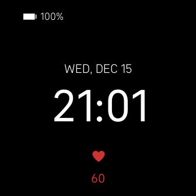
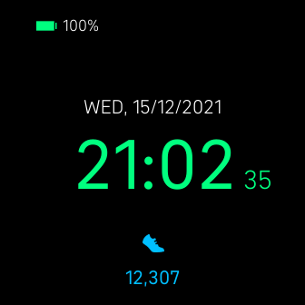

<h1 align="center">
    <br>
    Minimalistic Digital
    <br>
</h1>


[](https://gallery.fitbit.com/details/1b9dea00-dcde-471f-817c-0ece833cbe8a)

This is a simple clockface with a minimalistic look. It has got a little bit of customizations which can be set as per the user's taste.
<br>

Displays:
- Time
- Seconds
- Date
- Day
- Month
- Battery
- Stats on rotation (Heart Rate, Steps, Calories, Floors, Distance)

# Screenshots




<br>

# Development
```
npm install
```

# Build
```
npx fitbit
fitbit$ build
fitbit$ install
```
